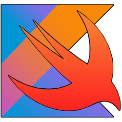

# Kotlin to Swift Transpiler

<p align="center">
  
</p>

This project implements a transpiler that translates Kotlin code into equivalent Swift code using a simplified grammar of Kotlin. The functionality includes grammar definition, automatic generation of the lexer and parser, lexical and syntactical analysis to build a parse tree, and semantic analysis to ensure logical correctness of the translation. The transpiler translates Kotlin syntax structures into Swift code, preserving logic and flow while performing the necessary checks.

## 🛠️ Technologies Used

- **ANTLR (ANother Tool for Language Recognition)**: A powerful tool for generating parsers from custom grammars. ANTLR simplifies parser creation, reduces development complexity, and minimizes error risks.
- **Java 17.0.2 or higher**: The transpiler is implemented and tested using Java 17.0.12.
- **Python 3.x**: The transpiler is implemented and tested using Python 3.13.0.
- **Makefile**: A tool to automate build, execution, and cleanup tasks related to the transpiler.

## 🎯 Features

- **Grammar Definition**: A simplified Kotlin grammar that enables accurate translation to Swift.
- **Lexer and Parser Generation**: Automatic generation using ANTLR based on the defined grammar.
- **Semantic Analysis**: Ensures the correctness of translations with checks for proper declarations, type correctness, and logical consistency.
- **Parse Tree Generation**: The parse tree is generated and traversed to map Kotlin constructs to their Swift equivalents.
- **Error Reporting**: Lexical, syntactical, and semantic errors are detected, and detailed messages are shown in the console.

## ⚙️ Project Setup

To run the transpiler, please follow these steps:

1. Ensure the following prerequisites are met (the project was developed on macOS, so some instructions might vary on other operating systems):

    - Install Java, with a minimum version of 17.0.2 (Java 17.0.12 is recommended). If you're using a different version, update the `JAVA_HOME` variable in your `.zshrc` file.
    - Install Python 3.x (recommended version: 3.13.0) and activate a virtual environment (`venv`) to isolate the project's dependencies. Depending on your Python version, you may encounter certificate verification errors. To resolve this, manually install certificates by running the `Install Certificates.command` in `/Applications/Python 3.x`.
    - Install ANTLR using the command: `pip install antlr4-tools`.
    - Configure the environment variables properly. On Unix-based systems, run: `source .zshrc`. For non-Unix systems, different commands may be required to achieve the same behavior with environment variables.

2.  Clone the repository:

    ```bash
    git clone https://github.com/angelacassanelli/Kotlin2SwiftTranspiler
    cd Kotlin2SwiftTranspiler
    ```

3.  Set up a virtual environment (recommended):

    ```bash
    python3 -m venv venv
    source venv/bin/activate
    ```

## 🚀 Running the Transpiler

Once the prerequisites are set, the transpiler can be executed using the Makefile. Here are the commands to run:

1. To clean the development environment, use:

    ```bash
    make clean
    ```

2. To build the transpiler and generate the necessary files, use:

    ```bash
    make all
    ```

3.  To run the transpiler with a specific Kotlin file, use the following command:
   
    ```bash
    make run KOTLIN_FILE=path_to_kotlin_file
    ```

    Replace path_to_kotlin_file with the path to the Kotlin file you want to convert. For example:

    ```bash
    make run KOTLIN_FILE=tests/test_case_1
    ```

    The transpiler will read the Kotlin code, generate the parse tree, perform semantic checks, and generate the corresponding Swift code. Any errors (lexical, syntactical, or semantic) will be displayed with detailed information about their type and location. If there are no errors, the generated Swift code will be printed to the console and saved in output/output.swift.

## 🏗️ Architecture of the Transpiler

The project follows a modular architecture, which ensures a clear separation of responsibilities, making the system easy to extend and maintain. 

- **`antlr/`**: Contains the formal grammar definition in the `Kotlin.g4` file, which specifies lexical tokens (such as keywords like `class`, `fun`, operators like `+`, and symbols like `(` and `{`). It also defines syntactic rules for Kotlin constructs, including classes, functions, and expressions. This grammar is used by ANTLR to automatically generate essential components such as the lexer, parser, and auxiliary modules.

- **`generated/antlr/`**: Contains the files generated by ANTLR from the `Kotlin.g4` grammar, including:
  - **`KotlinLexer.py`**: Handles lexical analysis.
  - **`KotlinParser.py`**: Builds the parse tree from recognized tokens.
  - **`KotlinListener.py`**: Traverses and manipulates the parse tree.

- **`src/`**: Contains the core modules of the transpiler that implement various stages of the translation process:
  - **`transpiler.py`**: Manages the entire process of translating Kotlin to Swift, starting with loading the Kotlin code, parsing it into a parse tree, and then using the visitor pattern in `KotlinToSwiftVisitor.py` to convert parse tree nodes into Swift code. Errors are handled and reported using custom error listeners.
  - **`KotlinToSwiftVisitor.py`**: Implements the Visitor pattern to traverse the parse tree and convert each node to its Swift counterpart while performing semantic analysis to ensure logical correctness.
  - **Error Listeners**: `LexicalErrorListener.py`, `SyntaxErrorListener.py`, and `SemanticErrorListener.py` handle lexical, syntactic, and semantic errors, respectively, collecting error messages for centralized management.
  - **`SymbolTable.py`**: Implements a symbol table to track variables, functions, and classes within scopes, aiding in semantic analysis.
  - **`Types.py`**: Defines supported data types for Kotlin and Swift.
  - **`Utils.py`**: Provides utility structures, including a dictionary to map Kotlin types to Swift types and a set of reserved keywords that cannot be used as variable, function, or class names.

- **`output/`**: Contains the final Swift code (`output.swift`), generated when the input code is free of lexical, syntactic, and semantic errors.

- **`tests/`**: Contains Kotlin source code files used for testing the transpiler, ensuring correct translation and semantic analysis under different scenarios.

## 📚 Kotlin Grammar

The transpiler is designed to translate a restricted subset of the Kotlin language into Swift. The defined grammar reflects a limited yet representative set of Kotlin constructs and features. Below are the main characteristics:

### 🧩 Supported Constructs
- **Input and Output**:  
  - Input reading with `readLine()` to gather user input.  
  - Output printing with `println()` to display messages or values.  
- **Conditional Statements**:  
  - Support for `if` and `if-else` blocks.  
- **Iterative Statements**:  
  - Handling `for` loops over defined numeric ranges (`range` with `..`).  
- **Variable Declarations**:  
  - Mutable variables declared with `var`.  
  - Immutable variables declared with `val`.  
- **Functions**:  
  - Function declaration and usage with specified parameters and return types.  
  - Functions that do not return a value must specify `Unit` in Kotlin (translated to `Void` in Swift).  
- **Classes**:  
  - Declaration of classes with properties and methods.  
  - Classes cannot be instantiated due to the limited set of supported data types.  
- **Data Types**:  
  - `Int` for integers.  
  - `Boolean` for logical values (`true` and `false`).  
  - `String` for text.  

### 📝 Grammar Rules
- **Operators**:  
  - Mathematical operators: `+`, `-`, `*`, `/`, `%`.  
  - Comparison operators: `==`, `!=`, `<`, `<=`, `>`, `>=`.  
  - Logical operators: `&&`, `||`, `!`.  
- **Comments**:  
  - Support for single-line comments (`//`) and block comments (`/* */`).  
- **Syntactic Constructs**:  
  - Variable declarations and initializations.  
  - Complex expressions with respect for operator precedence.  
  - Code blocks enclosed in `{}` for functions, conditions, and loops.  

### ⚠️ Limitations
- Classes cannot be instantiated.  
- Supported data types are limited to `Int`, `Boolean`, and `String`.  
- Advanced constructs like lambdas, generics, or coroutines are not supported.  

### 👩🏻‍💻 Example Code
Here is an example of Kotlin code compatible with the transpiler:

```kotlin
// Class representing a simple Counter
class Counter {

    // Variable to store the current value of the counter.
    var count: Int = 0

    // Function to increment the counter by 1.
    fun increment() {
        println("Increment Counter")
        count = count + 1
    }

    // Function to reset the counter to 0.
    fun reset() {
        println("Reset Counter")
        count = 0
    }

    // Function to check if the counter value is even.
    // Returns true if even, false otherwise.
    fun checkIfEven(): Boolean {
        println("Check if counter is even")
        return count % 2 == 0
    }

    /* Function to test the counter's behavior:
    1. Resets the counter;
    2. Increments the counter 5 times;
    3. Checks if the counter value is even or odd;
    4. Prints the result;
    5. Returns a string "Even" or "Odd" based on the result. */
    fun checkEvenOrOdd(): String {
        reset()

        var i: Int = 1
        for (i in 1..5) {
            increment()
        }

        val isEven: Boolean = checkIfEven()

        if (isEven) {
            println("Counter is even")
            return "Even"
        } else {
            println("Counter is odd")
            return "Odd"
        }
    }

}
```

Below is its Swift translation, generated by the transpiler:

```swift
# Class representing a simple Counter
class Counter {

  # Variable to store the current value of the counter.
  var count : Int = 0
  
  # Function to increment the counter by 1.
  func increment() {
    print("Increment Counter")
    count = count + 1
  }

  # Function to reset the counter to 0.
  func reset() {
    print("Reset Counter")
    count = 0
  }

  # Function to check if the counter value is even.
  # Returns true if even, false otherwise.
  func checkIfEven() -> Bool {
    print("Check if counter is even")
    return count % 2 == 0
  }

  /* Function to test the counter's behavior:
  1. Resets the counter;
  2. Increments the counter 5 times;
  3. Checks if the counter value is even or odd;
  4. Prints the result;
  5. Returns a string "Even" or "Odd" based on the result. */
  func checkEvenOrOdd() -> String {
    reset()
    
    var i : Int = 1
    for i in 1 ... 5 {
      increment()
    }
    
    let isEven : Bool = checkIfEven()

    if isEven {
      print("Counter is even")
      return "Even"
    } else {
      print("Counter is odd")
      return "Odd"
    }
  }

}
```

## ✅ Validation of the Transpiler

To ensure the correct functionality of the transpiler, five test cases have been defined, corresponding to the files `test_case_1`, `test_case_2`, `test_case_3`, `test_case_4`, and `test_case_5`. These cases include both valid programs and intentionally erroneous programs.

The primary goal of these tests is to verify that the transpiler correctly translates valid Kotlin code into equivalent Swift code. Additionally, the tests aim to assess the effectiveness of the error listeners in detecting and reporting lexical and syntactic errors, as well as the correctness of the semantic analysis in identifying and reporting logical errors with clear and detailed messages.

The expected output for each test case is either:

- A Swift code that is syntactically and semantically equivalent to the original Kotlin program if no errors are present, or
- Accurate reporting of any lexical, syntactic, or semantic errors, thereby preventing the generation of invalid code.

## 💌 Get in Touch 

- **Documentation**: Check the detailed project [documentation](./doc/Kotlin2SwiftTranspiler.pdf) in the repository.  
- **Support**: For issues or questions, feel free to open an [issue](https://github.com/angelacassanelli/Kotlin2SwiftTranspiler/issues) or contact the development team at [angelacassanelli98@gmail.com](mailto:angelacassanelli98@gmail.com).  

Thank you for checking out the **Kotlin to Swift Transpiler**! ✨
